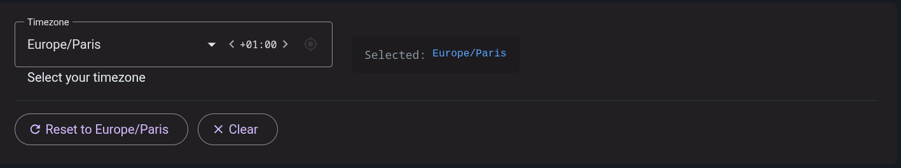

<p align="center">
  <a href="https://www.softwarity.io/">
    
  </a>
</p>

# @softwarity/timezone-select

<p align="center">
  <a href="https://www.npmjs.com/package/@softwarity/timezone-select">
    
  </a>
  <a href="https://github.com/softwarity/timezone-select/blob/main/LICENSE">
    
  </a>
</p>

An Angular Material timezone selector component with UTC offset navigation. Browse timezones by offset using arrow buttons, then select a specific timezone from the filtered dropdown.

**[Live Demo](https://softwarity.github.io/timezone-select/)**

<p align="center">
  <a href="https://softwarity.github.io/timezone-select/">
    
  </a>
</p>

## Features

- **UTC Offset Navigation** - Browse timezones by offset with `< +00:00 >` arrows (infinite loop)
- **Browser Timezone Detection** - Optional button to auto-detect and set browser timezone
- **IANA Timezone Names** - Uses native `Intl.supportedValuesOf('timeZone')` for timezone data
- **MatFormField Compatible** - Implements `MatFormFieldControl` for seamless integration
- **Reactive Forms Support** - Implements `ControlValueAccessor` for use with Angular forms
- **Material 3 Ready** - Uses M3 design tokens for theming
- **Standalone Component** - Easy to import in any Angular 21+ application
- **No Dependencies** - Uses native JavaScript `Intl` API for timezone data

## Installation

```bash
npm install @softwarity/timezone-select
```

### Peer Dependencies

| Package | Version |
|---------|---------|
| @angular/common | >= 21.0.0 |
| @angular/core | >= 21.0.0 |
| @angular/cdk | >= 21.0.0 |
| @angular/material | >= 21.0.0 |

## Usage

Import the component in your Angular component:

```typescript
import { TimezoneSelectComponent } from '@softwarity/timezone-select';
import { MatFormFieldModule } from '@angular/material/form-field';
import { ReactiveFormsModule, FormControl } from '@angular/forms';

@Component({
  selector: 'app-my-component',
  imports: [TimezoneSelectComponent, MatFormFieldModule, ReactiveFormsModule],
  template: `
    <mat-form-field appearance="outline">
      <mat-label>Timezone</mat-label>
      <timezone-select [formControl]="timezoneControl" />
      <mat-hint>Select your preferred timezone</mat-hint>
    </mat-form-field>
  `
})
export class MyComponent {
  timezoneControl = new FormControl('Europe/Paris');
}
```

## API

### Selector

`timezone-select`

### Inputs

| Input | Type | Default | Description |
|-------|------|---------|-------------|
| `placeholder` | `string` | `''` | Placeholder text |
| `required` | `boolean` | `false` | Whether the field is required |
| `disabled` | `boolean` | `false` | Whether the field is disabled |
| `showDetectButton` | `boolean` | `false` | Shows a button to detect and set browser timezone |

### Outputs

| Output | Type | Description |
|--------|------|-------------|
| `valueChange` | `EventEmitter<string \| null>` | Emits when the selected timezone changes |

### Value

The component value is an IANA timezone name string (e.g., `'Europe/Paris'`, `'America/New_York'`, `'UTC'`).

## Theming (Material 3)

The component provides a SCSS mixin for theming. Import and use it in your `styles.scss`:

```scss
@use '@angular/material' as mat;
@use '@softwarity/timezone-select/timezone-select-theme' as timezone-select;

html {
  @include mat.theme((color: (primary: mat.$violet-palette)));

  // Apply timezone-select theme
  @include timezone-select.theme();
}
```

## Examples

### Basic Usage

```typescript
import { TimezoneSelectComponent } from '@softwarity/timezone-select';

@Component({
  imports: [TimezoneSelectComponent, MatFormFieldModule, ReactiveFormsModule],
  template: `
    <mat-form-field>
      <mat-label>Timezone</mat-label>
      <timezone-select [formControl]="control" />
    </mat-form-field>
  `
})
export class MyComponent {
  control = new FormControl('UTC');
}
```

### With Value Change Handler

```typescript
@Component({
  template: `
    <mat-form-field>
      <mat-label>Timezone</mat-label>
      <timezone-select
        [formControl]="control"
        (valueChange)="onTimezoneChange($event)" />
    </mat-form-field>
  `
})
export class MyComponent {
  control = new FormControl('America/New_York');

  onTimezoneChange(timezone: string | null): void {
    console.log('Selected timezone:', timezone);
  }
}
```

### Disabled State

```typescript
@Component({
  template: `
    <mat-form-field>
      <mat-label>Timezone</mat-label>
      <timezone-select [formControl]="control" />
    </mat-form-field>
  `
})
export class MyComponent {
  control = new FormControl({ value: 'Europe/London', disabled: true });
}
```

## Timezone Data

The component uses the native JavaScript `Intl` API to:
- Get the list of supported timezones: `Intl.supportedValuesOf('timeZone')`
- Calculate UTC offsets: `Intl.DateTimeFormat` with `timeZoneName: 'shortOffset'`

This ensures the timezone data is always up-to-date with the browser's IANA timezone database.

## License

MIT
